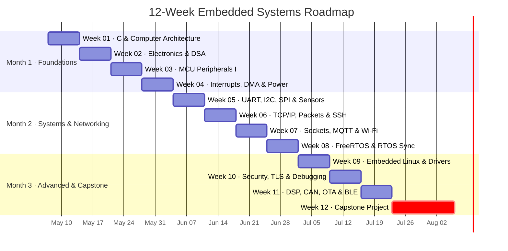
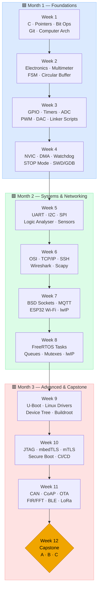

# Embedded Systems Engineering Roadmap

3-month collaborative roadmap — C, electronics, bare-metal MCU, serial protocols, TCP/IP, SSH, RTOS, embedded Linux, TLS, and a capstone project.

**Start date:** May 7, 2026 | **End date:** ~August 6, 2026

> Based on [m3y54m/Embedded-Engineering-Roadmap](https://github.com/m3y54m/Embedded-Engineering-Roadmap)
> Color coding: 🟡 Required · 🩷 Recommended · ⬜ Optional

---

## Roadmap at a Glance





---

## Team

| Name | GitHub | Focus |
|------|--------|-------|
| Amogh | @Majorwhiskey | Embedded systems |
| Vaishnavi | @vaishnaviuh | Embedded systems |
| Sujay | @sujaygouda123 | Embedded systems |

---

## Repository Structure

```
embedded-engineering-roadmap/
├── README.md
├── .gitignore
├── docs/
│   └── references.md        ← all resource links
├── shared/                  ← shared utilities, headers, scripts
├── week01/
│   ├── README.md            ← topics + projects for that week
│   ├── amogh/
│   ├── vaishnavi/
│   └── sujay/
├── week02/ … week12/        ← same pattern
```

Each person works in their own subfolder. Use PRs for code review.  
Commit format: `weekNN: short description` — e.g. `week01: add bit manipulation library`

---

## Month 1 — Foundations (Weeks 1–4)

**Goal:** C programming, electronics, bare-metal MCU peripherals, debugging

| Week | Title | Key Topics |
|------|-------|-----------|
| [01](week01/README.md) | C Programming & Computer Architecture | Pointers, memory model, bit manipulation, digital logic, Git |
| [02](week02/README.md) | Electronics, Data Structures & Algorithms | Ohm's law, oscilloscope, FSM, circular buffer, sorting |
| [03](week03/README.md) | MCU Peripherals I — GPIO, Timers, ADC, DAC, PWM | Bare-metal register writes, clock tree, linker scripts |
| [04](week04/README.md) | Interrupts, DMA, Watchdog & Power Management | NVIC, DMA circular mode, IWDG, STOP mode, SWD+GDB |

---

## Month 2 — Systems & Networking (Weeks 5–8)

**Goal:** Serial protocols, full TCP/IP networking, SSH, sockets, MQTT, Wi-Fi, RTOS

| Week | Title | Key Topics |
|------|-------|-----------|
| [05](week05/README.md) | Serial Protocols — UART, I2C, SPI & Sensors | Register maps, logic analyser, BMP280, MPU6050, ILI9341 |
| [06](week06/README.md) | Networking — OSI, TCP/IP, Packets, SSH | Wireshark, TCP handshake, SSH hardening, Scapy, DNS, DHCP |
| [07](week07/README.md) | Socket Programming, MQTT & Wi-Fi on MCU | BSD sockets, select/epoll, MQTT QoS, ESP32 lwIP, Node-RED |
| [08](week08/README.md) | RTOS — FreeRTOS, Tasks, Sync & Scheduling | Queues, mutexes, semaphores, event groups, heap management |

---

## Month 3 — Advanced & Capstone (Weeks 9–12)

**Goal:** Embedded Linux, security, TLS, DSP, OTA, capstone project

| Week | Title | Key Topics |
|------|-------|-----------|
| [09](week09/README.md) | Embedded Linux — Kernel, Drivers, Device Tree, IPC | U-Boot, char drivers, sysfs, Buildroot, pthreads |
| [10](week10/README.md) | Debugging, Embedded Security & TLS | JTAG/SWD, hardfault debug, mbedTLS, mTLS, secure boot |
| [11](week11/README.md) | Advanced Protocols, DSP & OTA Updates | CAN bus, CoAP, FIR/IIR filters, FFT, dual-bank OTA, BLE |
| [12](week12/README.md) | Capstone Project | Full system integration — see options below |

---

## Capstone Options (Week 12)

**Option A — Secure IoT Gateway**  
STM32/ESP32 → FreeRTOS (4 tasks) → TLS MQTT → Raspberry Pi gateway (Mosquitto + FastAPI) → Node-RED dashboard. OTA updates pushed from Pi. GitHub Actions CI on every push.

**Option B — Remote SSH Sensor Node**  
Battery-powered STM32 + ESP32. STOP-mode sleep, sensor every 30 s, sync to server via SFTP when Wi-Fi available. TLS, watchdog, reverse SSH tunnel for remote debug. Target: <5 mA average.

**Option C — Networked CAN Bus Monitor**  
RPi + MCP2515 reads CAN frames / OBD-II PIDs → WebSocket dashboard (Chart.js) → InfluxDB logging → MQTT alerts → SSH tunnel access. Full systemd services with watchdog.

---

## Getting Started

### SSH Key Setup
```bash
ssh-keygen -t ed25519 -C "your_email@example.com"
cat ~/.ssh/id_ed25519.pub   # paste into GitHub → Settings → SSH keys
```

### Clone & First Commit
```bash
git clone git@github.com:Majorwhiskey/embedded-engineering-roadmap.git
cd embedded-engineering-roadmap/week01/amogh    # or vaishnavi / sujay
echo "# Week 1 — Amogh" > README.md
git add README.md
git commit -m "week01: initial commit for amogh"
git push
```

### Install Tools (Week 1)
```bash
sudo apt install build-essential valgrind gdb git
# VS Code extensions: C/C++, GitLens
```

---

## Resources

See [docs/references.md](docs/references.md) for all links.
